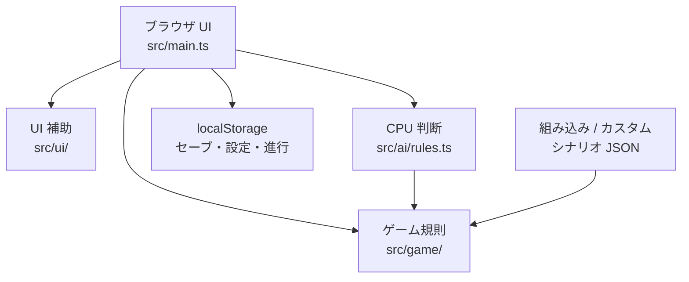
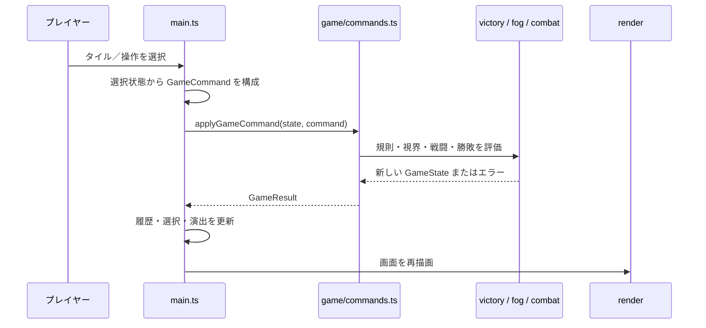
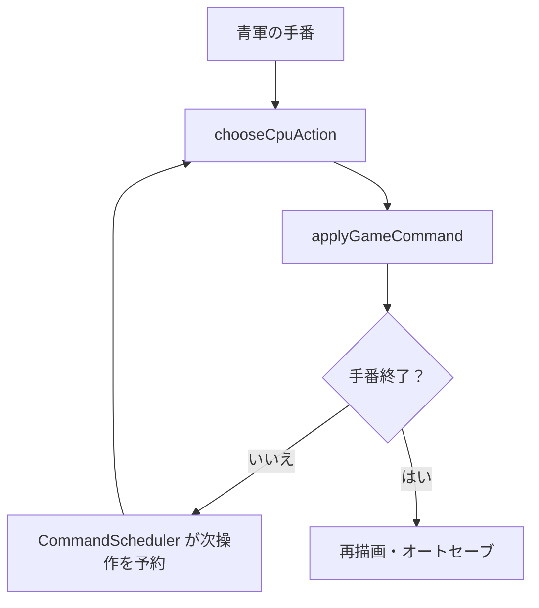

# MiniStr 実装ガイド

この文書は、MiniStr の機能一覧ではなく、実装を変更・調査する開発者が「どの層が何を保証し、どこから呼ばれるか」を追うための設計資料です。プレイ方法とゲームルールは [README](../README.md) を参照してください。

## 1. 設計の要点

MiniStr は、ブラウザ UI とゲーム規則を分離した TypeScript / Vite アプリケーションです。

- **ゲーム規則は `src/game/` に置く**。ここは DOM に依存せず、入力状態から新しい状態またはエラーを返す純粋関数を中心にする。
- **`src/main.ts` は統合層**。UI の選択状態を持ち、ゲームコマンドを発行し、描画・効果・CPU の進行・保存をつなぐ。
- **シナリオ、セーブ、リプレイは検証してから使う**。外部から来る JSON をそのままゲーム状態にしない。
- **再現性を守る**。乱数は `GameState.rngSeed` に含め、操作履歴を適用してセーブ／リプレイを復元する。
- **霧・CPU の情報境界を守る**。プレイヤー向けの移動可能範囲と CPU の評価には、可視の敵だけを渡す。

## 2. 全体構成



### ディレクトリ別の責務

| 場所 | 主な責務 | 変更時の注意 |
| --- | --- | --- |
| `src/main.ts` | 画面状態、イベント委譲、描画、CPU 実行、保存／読込、各画面の切替 | ゲーム規則を直接書かず、`GameCommand` と `src/game/` の関数を介す |
| `src/game/types.ts` | `GameState`、盤面、ユニット、座標、結果型の定義 | 保存・リプレイに影響する型は後方互換性を検討する |
| `src/game/state.ts` | 初期状態作成、盤面／ユニット／拠点の問い合わせ | 状態を直接可変にしない |
| `src/game/commands.ts` | 移動、攻撃、占領、生産、待機、合流、乗船、上陸、ターン終了 | 実行可否をここで検証し、`GameResult` を返す |
| `src/game/terrain.ts` | 地形参照、移動コスト、座標操作 | 移動範囲は可変コストのためダイクストラ法を使う |
| `src/game/units.ts` | ユニット能力値、分類、輸送・合流可否 | 能力値変更は AI・戦闘・シナリオ・テストへ波及する |
| `src/game/facilities.ts` | 拠点判定と工場／空港／港湾の生産規則 | シナリオの生産規則との整合を保つ |
| `src/game/combat.ts` | 射程・相性・HP・地形を反映した戦闘予測 | 実ダメージの乱数処理は `commands.ts` 側で状態の seed を進める |
| `src/game/fog.ts` / `threat.ts` | 可視範囲、可視敵、危険域の算出 | 未索敵情報を UI／AI に漏らさない |
| `src/game/maps.ts` | シナリオ型、JSON 検証、組み込みマップ、初期状態生成 | 組み込みマップの変更は既存セーブとの互換性を確認する |
| `src/game/victory.ts` | 勝敗条件、保持ターン、スコアの評価 | コマンド後・ターン進行後の評価経路を壊さない |
| `src/game/session.ts` | セーブ／読込、操作履歴の再適用、保存データ検証、セーブスロット | JSON のサイズ・形状・初期状態の一致を検証する |
| `src/game/replay.ts` | リプレイ作成、移行、整合性検証、JSON 入出力 | `finalState` と `summary` は履歴から再計算して検証する |
| `src/game/campaign.ts` | ステージ解放、評価、キャンペーン進行の保存・移行 | スキーマ変更時は移行関数とテストを追加する |
| `src/game/editor.ts` | エディタ状態、編集操作、シナリオ JSON 入出力 | エディタ独自の緩い検証を作らず `maps.ts` の検証を再利用する |
| `src/ai/rules.ts` | 難易度別の CPU 行動選択 | 合法な高レベル命令だけを返し、適用はゲームコマンド層に任せる |
| `src/ui/` | キーボード操作、ズーム、ラベル、マス情報、演出、音、文言、セーブ一覧 | 規則ではなく表示・入力補助を担う |
| `src/style.css` | レイアウト、レスポンシブ表示、演出 | セマンティックな操作順序を壊さない |

`src/game/index.ts` は上記ゲームモジュールの再エクスポート窓口です。アプリケーションの起動点ではありません。

## 3. 状態モデルと不変条件

中心となる `GameState` は次を持ちます。

| 項目 | 意味 |
| --- | --- |
| `board` | 幅・高さと、地形／所有者／占領進行度を持つ二次元盤面 |
| `units` | 盤上または輸送中のユニット。盤上なら `position`、乗船中なら `embarkedIn` を持つ |
| `players` | 赤軍・青軍の資金と、直近手番で得た収入 |
| `activePlayer` / `turn` | 現在の手番と、両軍が行動した完全ラウンド数 |
| `winner` | 決着後に設定される勝者 |
| `scenarioId` | シナリオ依存の生産規則・勝敗条件を引くための識別子 |
| `scores` / `objectiveHoldTurns` | スコア戦・指定地点保持の進行 |
| `rngSeed` | 戦闘の揺らぎを再現するための決定的乱数状態 |
| `nextUnitId` | 生産ユニットの安定した ID 発行元 |

守るべき代表的な不変条件は次のとおりです。

- 盤上ユニットは `position` を持ち、`embarkedIn` は持たない。乗船中ユニットはその逆である。
- 同じ盤面座標に複数の盤上ユニットを置かない。
- `activePlayer` 以外の部隊は操作できない。
- `hasMoved` と `hasActed` は手番終了時にリセットし、同一手番の重複行動を防ぐ。
- `winner` が設定済みの対局にはゲームコマンドを適用しない。
- 外部 JSON は、構造・上限・シナリオ初期状態・コマンドのすべてを検査できた場合だけ採用する。

## 4. 1 操作の実行シーケンス



`applyGameCommand` はコマンド種別を専用関数へ振り分ける入口です。UI は失敗メッセージを `src/ui/strings.ts` で利用者向けの日本語に変換します。規則側は英語の安定したエラー識別子を返すため、UI 文言の変更がゲーム規則やテストに波及しにくくなっています。

### 操作ごとの規則の要点

- **移動**: `movementCosts` が地形コストと残燃料を上限として到達コストを求める。未発見の敵に進路を塞がれた場合は、その直前で停止して情報を不当に開示しない。
- **攻撃**: 視認済みの敵だけを対象にする。予測値を求めた後、`rngSeed` から攻撃・反撃の揺らぎを決定し、撃破された輸送艦の搭載部隊も除去する。
- **占領**: 占領可能ユニットの HP に比例して `capturePoints` を減らす。占領途中に離脱・撃破・移動された拠点は進行度を回復する。
- **生産**: 所有する空き施設、対応する生産規則、資金を同時に満たす必要がある。生産部隊はその手番に移動・行動済みで配置される。
- **合流**: 同種・隣接・未行動の友軍を 1 部隊へ統合する。生存部隊の ID を維持するので、リプレイで結果が安定する。
- **乗船／上陸**: 歩兵を隣接する輸送艦へ載せ、輸送艦と搭載部隊の同一手番での海越えを防ぐ。上陸先は隣接する空き陸地に限る。
- **ターン終了**: 手番を交代し、収入、補給、燃料処理、勝敗・ターン制限を規則層で進める。

## 5. 手番と CPU

青軍の CPU も、プレイヤーと同じゲームコマンドを使います。CPU は盤面を直接書き換えません。



`chooseCpuAction` は、概ね「占領 → 攻撃 → 輸送 → 生産 → 移動 → 手番終了」の優先順で 1 件の高レベル操作を選びます。難易度設定は、敵からの圧力、地形防御、目標距離、低 HP 時の退避を重み付けします。

CPU 計画コンテキストは可視敵だけで構成されます。島しょ目標については、歩兵が移動できる陸地連結成分を求め、異なる連結成分の目標にだけ輸送艦を使うため、海を徒歩経路として誤認しません。操作を連続表示する遅延と中断は `CommandScheduler` が一つのキャンセル可能なタイマーとして管理します。

## 6. 視界・戦闘・勝敗の境界

### 視界

`fog.ts` が各軍の可視座標と可視敵を算出します。UI の敵表示、攻撃可否、到達範囲プレビュー、CPU の脅威評価はこの境界を通します。したがって、機能追加時に生の `state.units` を敵情報として UI や CPU に渡すと霧の規則を破るおそれがあります。

### 戦闘

`combat.ts` は射程、ユニット相性、攻防、HP、地形防御を使って予測を返します。実行側はその予測値に決定的乱数の揺らぎを適用します。間接射撃は移動したターンに攻撃できず、反撃は条件を満たす直接戦闘だけです。

### 勝敗

`victory.ts` は、敵全滅、司令部占領、指定地点の連続保持、生存、スコアを評価します。得点と保持ターンは状態に保持し、操作後または手番進行後に評価するため、UI が個別条件を再実装する必要はありません。

## 7. シナリオとエディタ

シナリオは JSON 互換の定義で、ID、名称、ブリーフィング、開始資金、盤面、初期部隊、生産規則、勝利／敗北条件、必要に応じてターン制限を持ちます。

```
シナリオ JSON
  → maps.ts の形状・参照・盤面検証
  → ScenarioDefinition
  → createScenarioInitialState
  → GameState
```

組み込みマップとカスタムマップは、同じ検証境界を通ります。エディタの `applyEditorTool` は編集中のデータを不変に更新し、インポート、出力前検証、試遊開始では `maps.ts` の検証を再利用します。新しい地形・生産規則・勝敗条件を追加するときは、シナリオ検証、初期状態生成、UI 表示、AI の目標選択、テストをまとめて確認してください。

## 8. 保存・リプレイ・キャンペーン

### 保存

ゲームセッションは初期状態とコマンド履歴を中心に扱います。保存読み込みでは、JSON サイズ、オブジェクト形状、ゲーム状態、シナリオとの初期状態一致、乗船関係、コマンドの合法性を検証します。セーブスロットは `session.ts` で管理し、`ui/saveSlots.ts` は一覧表示だけを担当します。

保存形式を変える場合は、既存データを読める移行関数を追加するか、明示的に非互換とする理由と扱いを決めます。組み込みシナリオの初期状態を変更すると、そのシナリオの過去セーブとの一致検証に影響することにも注意してください。

### リプレイ

リプレイは `initialState`、コマンド列、最終状態、集計、作成日時を持ちます。読み込み時にはスキーマ移行後、コマンド列を再適用し、保存済み `finalState` と `summary` が再計算結果に一致することを確認します。これにより、JSON の見た目だけが正しい不正リプレイを採用しません。

### キャンペーン

キャンペーン進行は解放済みステージと最高評価を保存します。勝利結果から S/A/B/C を算出して次のステージを解放します。キャンペーンのスキーマ変更は `campaign.ts` にバージョン別移行を追加し、旧データの検証・移行テストを伴わせます。

## 9. UI とアクセシビリティ

`main.ts` は DOM を再描画し、選択中部隊、フォーカス座標、パネル表示、オーバーレイ、効果音・演出設定などの短命な UI 状態を保持します。ゲーム状態そのものは `src/game/` に委ねます。

`src/ui/` の主な補助は次のとおりです。

- `boardNavigation.ts`: 矢印キー、Home/End などの盤面フォーカス移動
- `boardZoom.ts`: 盤面幅と画面幅から既定ズームとタイル寸法を決定
- `tileInspector.ts`: タッチ環境でも読めるマス情報を組み立てる
- `labels.ts`: 地形・ユニットの表示名とトークン
- `presentationEffects.ts`: 意味論的なタイルボタンと分離した一時演出を描画
- `sound.ts`: 操作後に有効化される手続き音と設定の保存
- `strings.ts`: UI 日本語文言とエラー表示の変換
- `saveSlots.ts`: セーブ一覧の HTML を生成

DOM を変更するときは、キーボードフォーカス、`aria-label`、結果オーバーレイ表示中の背景操作、モバイルのマス情報導線を確認します。演出要素は操作対象の意味論的順序を変えないよう、タイルとは別要素として追加します。

## 10. 開発・検証

Node.js 22 以上と npm 10 以上を前提にします。代表的な確認コマンドは次のとおりです。

```bash
npm ci
npm run lint
npm run format:check
npm run typecheck:test
npm run test:coverage
npm run build
npm run test:e2e
npm run check:links
```

CI は pull request と `main` への push で、コミットメッセージの私的リンク検査、lint、整形確認、型検査、カバレッジ付きテスト、ビルド、Playwright E2E を実行します。GitHub Pages へのデプロイは `main` の成功した検証後だけです。

## 11. 機能を追加する際の実務的な順序

1. **規則を決める**: 型、状態、不変条件、境界ケースを `src/game/` に置く。
2. **コマンドとして表す**: UI／CPU／リプレイが同じ操作を再利用できる `GameCommand` と適用処理を追加する。
3. **表示を追加する**: `main.ts` と `src/ui/` は規則の結果を表示し、独自に可否判定を複製しない。
4. **保存互換を確認する**: 状態・シナリオ・リプレイ・キャンペーンのどれに影響するかを判断し、必要ならスキーマを上げて移行する。
5. **AI と霧を確認する**: CPU が違法操作や不可視情報を使わないこと、プレイヤーに情報を漏らさないことを確認する。
6. **テストを増やす**: 通常系だけでなく、無効な JSON、無効操作、旧スキーマ、ランダム結果の再現性、モバイル／キーボード操作に近い経路を対象にする。

## 12. 調査の起点

| 知りたいこと | 最初に読む場所 |
| --- | --- |
| ある操作が可能か／失敗理由は何か | `src/game/commands.ts` |
| 移動範囲や地形通行可否 | `src/game/terrain.ts`、`src/game/units.ts` |
| ダメージ予測と反撃 | `src/game/combat.ts` |
| 霧・危険域 | `src/game/fog.ts`、`src/game/threat.ts` |
| CPU がなぜその行動を選ぶか | `src/ai/rules.ts` |
| マップの初期配置や目標 | `src/game/maps.ts` |
| 保存・リプレイが拒否される条件 | `src/game/session.ts`、`src/game/replay.ts` |
| キャンペーンの解放・評価・移行 | `src/game/campaign.ts` |
| 画面の入力から描画まで | `src/main.ts`、対応する `src/ui/` モジュール |
| 回帰テストの例 | 各 `src/game/*.test.ts`、`tests/`、`tests/e2e/` |

この資料は実装の説明であり、仕様変更の代替ではありません。状態形式・ルール・公開 API を変更する PR では、この文書と README の両方が現行実装を表すかを確認してください。
